Let's start thinking about what we'll want in each our Login and Register screens.

# What goes on each a Login and Register Screen

There are a few common fields a login screen would ask from the user; enter your _email_ and _password_.
Sometimes, a login screen will ask for the user's _username_ and _password_.
In our case, we'll have two fields for the user to enter their _username_ and _password_.

> [info]
> Note: in this tutorial, we won't be actually logging in users or registering them on a server.
> We'll only be building the user interface and basic functionality of these screens.

# Building the Login Screen in the Storyboard

Now that we've thought about what to add on our Login Screen let's start building!
Open up your `Main.storyboard` and you should see this:

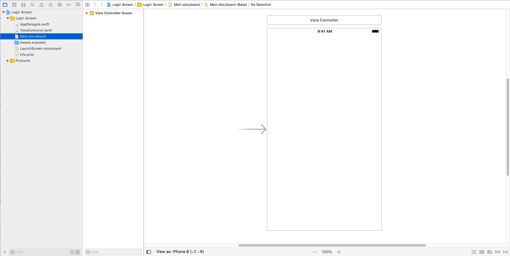

Nothing fancy, but what we want looks like this:

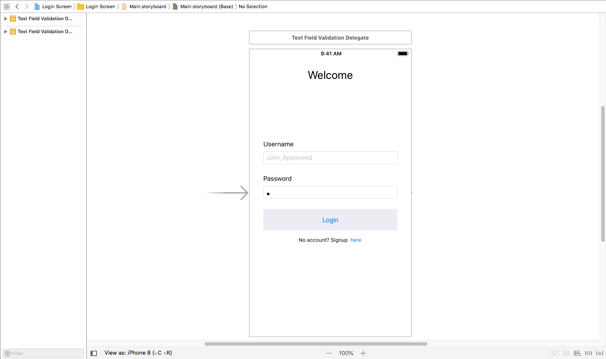

Before we move on, let's understand how this is laid out in the storyboard:

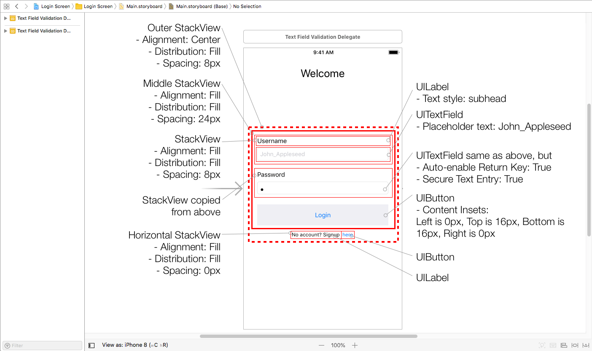

> [info]
> Don't worry! We'll go through each step on how to build this layout.
> Use this as a reference when debugging your project when laying out this screen.

Let's get started! We'll start with the two input fields; the username and password.

> [action]
> From the _Object Pallet_, add a `UITextField` and a `UILabel` and place them vertical of each other.
> With the label above the text field, select both and embed the two components in a **Vertical StackView**.

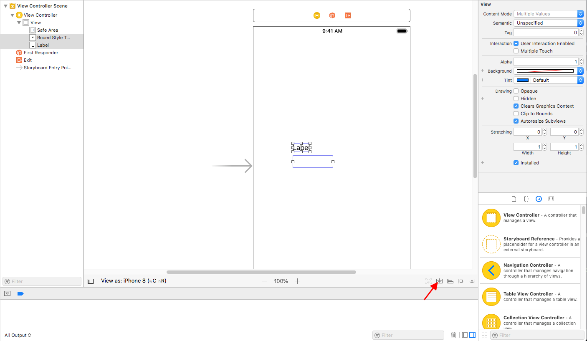

Select the **Vertical StackView** and in the _Attributes Inspector_, update the following:

> [action]
> - Alignment: Fill
> - Distribution: Fill
> - Spacing: 8px

## StackView: Alignments and Distributions:

Let's look at some of the different values a Stack View can have for alignment and distribution

> [info]
> Do note these images are for a **Vertical StackView**. For a **Horizontal StackView**, alignment will vary to Top, Bottom, Center and Fill.

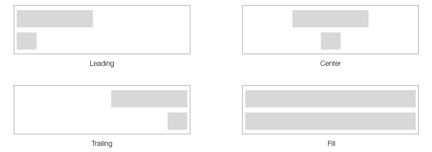

The alignment attribute for a Stack View will adjust where to shift the elements towards.

- Leading will shift the elements towards the left
- Center will center the elements
- Trailing will shift the elements towards the right, and
- Fill will stretch the elements to take up the entire size of the stack view

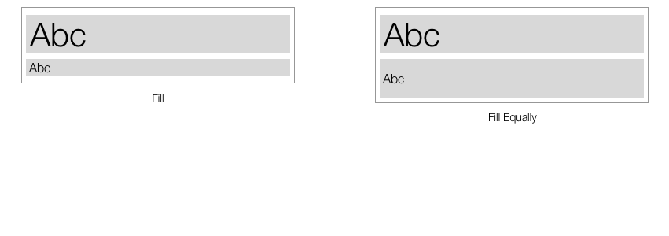

As for the distribution, this will adjust how big should each element take up.
Since we're looking at a **Vertical StackView**, this is referring to how tall should each element take up

- Fill will allow all of the elements to expand to its intrinsic size.
In other words, each element will resize to the smallest it can be depending on its content (for a `UILabel`, this will depend on the text that's inside and the font as well).

> [info]
> More on stack views in the Apple Docs [here](https://developer.apple.com/documentation/uikit/uistackview)

We'll worry about adjusting the label's font style and text field later.
Next, select the stack view and duplicate it.

> [action]
> Copy and paste the **Vertical StackView** below the first stack view.
>
> Now in the second **Vertical StackView**, update the label's title to *Password*.
> Again, we'll skip to the next step before adjusting the text field's attributes.

Now, for the **Login Button**:

> [action]
> From the _Object Pallet_, add a `UIButton` below the two **Vertical StackViews** and update the title to *Login*.

Great! We should have something like this:

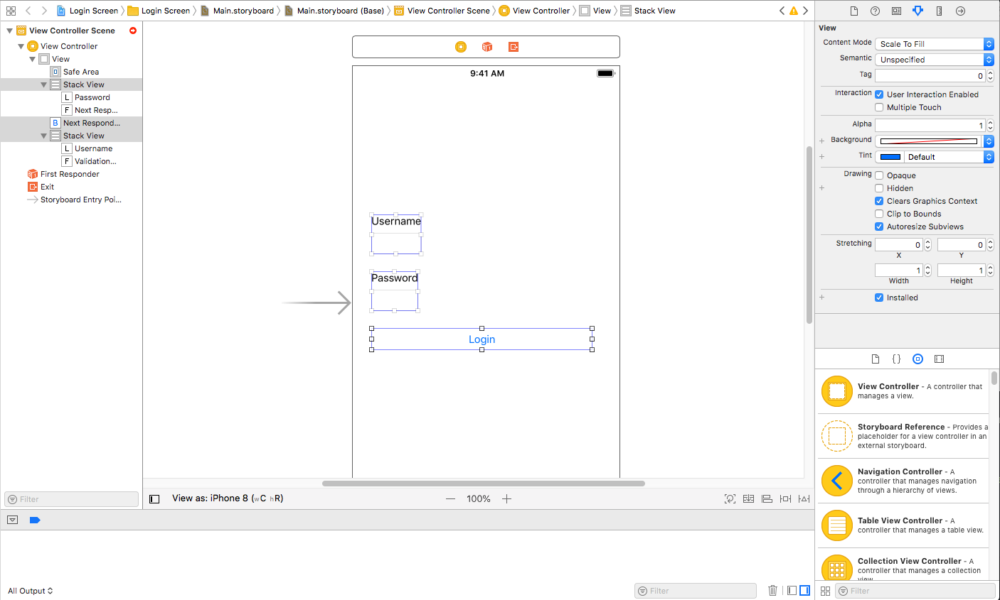

# Building the Login Screen - cont.

Now that we have each input field grouped with a label, let's stack it all together.

> [action]
> Select the two **Vertical StackViews** and the **Login Button** and embed these components in a new **Vertical StackView**.

Select the new **Vertical StackView** and update the following:

> [action]
> - Alignment: Fill
> - Distribution: Fill
> - Spacing: 24px

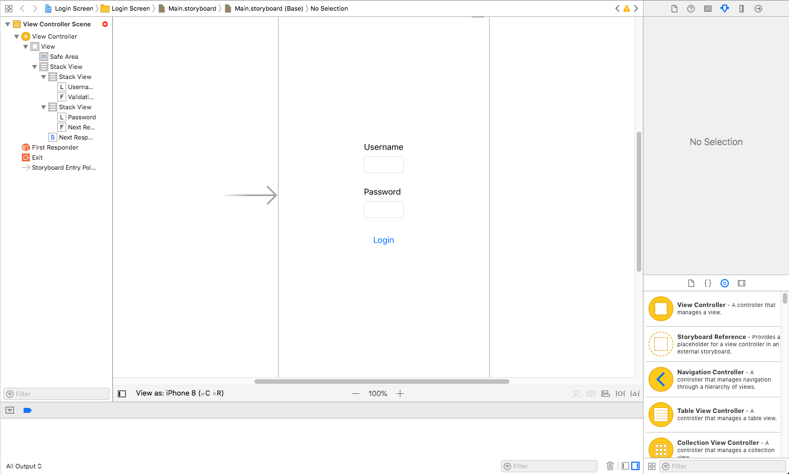

Not too bad! Before we adjust the components in the stack views and fix up the width of the stack view, let's finish up the last step by adding the register button.

> [action]
> From the _Object Pallet_, add a `UILabel` and a `UIButton`.
> Update the label's title to "No account? Signup" and button's title to "here".
> Place both components horizontally in a **Horizontal StackView** with the following attributes:
> - Alignment: Fill
> - Distribution: Fill
> - Spacing: 0px

> [info]
> Be sure to not embed this **Horizontal StackView** in the **Vertical StackView** that contains the input fields

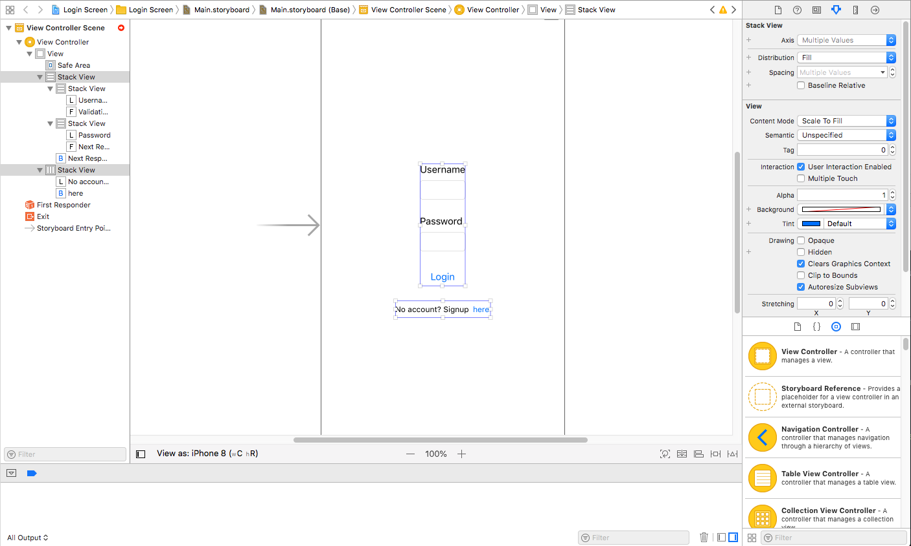

Before we fix the widths, be sure your object outline looks the same as here:

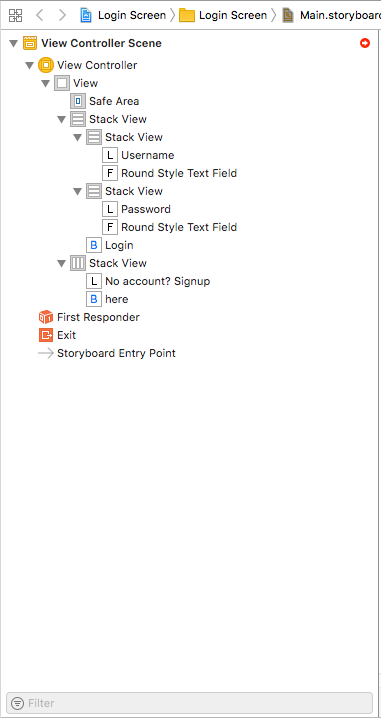

# Building the Login Screen - Fixing up the Widths

Let's add some _constraints_ to our stack views and fix up the widths of our input fields.

> [action]
> Select both the **Vertical StackView** and the **Horizontal StackView** and yet again, embed them in another **Vertical StackView**.
> Don't worry, this is perfectly fine to have this many embedded stack views.
> In fact, having this many stackviews will help reduce the amount of constraints we have to add.

> [action]
> For our newest **Vertical StackView** adjust the following
> - Alignment: Center
> - Distribution: Fill
> - Spacing: 8px

Neat! Our login screen is nearly completed.
But, before we fix the widths, let's add a constraint to help expand the widths:

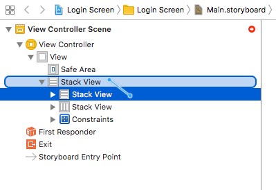

> [action]
> Select the inner **Vertical StackView** and from the _Object Outline_, _Ctrl_ + _Left Click_ _Drag_ from the **Selected Vertical StackView** to the **Outer Vertical StackView**.
> Select _Equal Widths_

Great! Now that we have our input fields, login button and register button embedded into one stack view, we can pin this one stack view to the screen, or view.

> [action]
> Add the necessary constraints:
> - center of the screen vertically
> - leading and trailing constrains

> [solution]
> Here, we pinned the outer stack view to the leading and trailing spacing.
> Each constraint has a constant of 15px.
> Then, we added a Vertical Centering constraint.
>
> 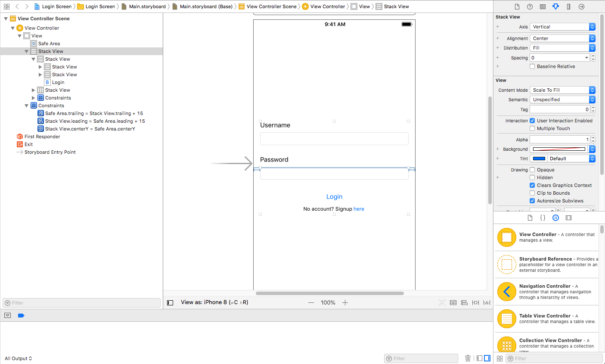

# Adjusting the attributes of the Labels, TextFields, and Login Button

## UILabels

When we're styling the fonts of our labels, it's important to understand the hierarchy of our text.
If we had a label with the text style of _Title_, this is best used to help the user navigate where they are in the app.
In our case, the login screen, or welcome screen.

> [action]
> For both the Username and Password labels, adjust their _text style_ to **Subhead**
>
> 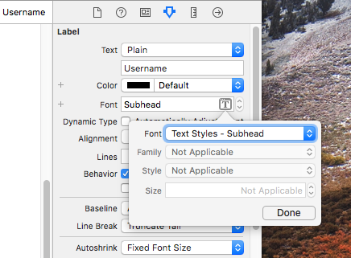

We'll leave the **No account? Signup** label how it is.

## UITextFields

Since we already have a label for each text field representing what each input field means, we'll add an example Username as the _Placeholder Text_ for the first text field.

> [action]
> Select the first text field and adjust its _Placeholder Text_ to "Johnny_Appleseed"

And for the password text field, we'll keep the _Placeholder Text_ empty, since we can't give an example for that.
Instead, adjust the following properties in the _Attributes Inspector_:

> [action]
> 1. Auto-enable Return Key to True
> 1. Secure Text Entry to True

## UIButton

Since our **Login Button** looks a bit plain, let's give it some padding and a background color:

> [action]
> Select the **Login Button** and in the _Size Inspector_, adjust the following to the _Content Insets_:
>
> - Left is 0px, Top is 16px, Bottom is 16px, Right is 0px
>
> This will give padding around the button's content, which is the button's title.

> [action]
> In the _Attributes Inspector_, scroll down and look for _Background_ and adjust its color

Whala! A finished login screen! Now, we'll leave it up to you to add the **Welcome Label** at the top.
Give it a try before looking at the steps in the solution.

> [solution]
> 1. Add a `UILabel` from the _Object Pallet_
> 1. Add a _Top Constraint_ constraint from the top of the label to the top of the _Safe Area_ with the constant at 24px
> 1. Add a _Horizontal Centering_ constraint from the label to the _Safe Area_
> 1. Adjust the label's text style to _Title_

# Running the App on the Simulator

Go ahead and give the project a run on the simulator.
You should see the input fields and their attributes like the secure text entry for the password.

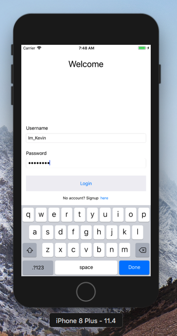
