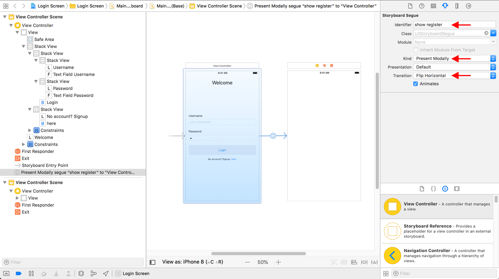

Now that we have the Login Screen all laid out, our next move is to add actions to the buttons and collect the input the user entered.

# Connecting the Storyboard with the ViewController

Go ahead and adjust your Xcode layout to have both the _Main.storyboard_ and the _ViewController.swift_ files open side by side.

> [action]
> 1. Add `@IBOutet`s to the **Username TextField** and the **Password **TextField**. Then,
> 1. Add `@IBAction`s to the **Login Button** and the **SignUp Button**.

> [solution]
>
```swift
class ViewController: UIViewController {
>
    @IBOutlet weak var textFieldUsername: UITextField!
    @IBOutlet weak var textFieldPassword: UITextField!
>    
    @IBAction func pressLogin(_ sender: Any) {
>        
    }
>    
    @IBAction func pressSignUp(_ sender: Any) {
>        
    }
}
```
>
> Your naming may be different from what you see here

Cool! Now that we have outlets to our textfields and an action for our login button, let's write a method that does our logging in:

# Write a Placeholder Method for Logging in

In this function, there should be two parameters, or arguments. One for the username, and the second for the password.
Don't worry, the body of this method will only have a comment.

> [action]
> Write a method in the ViewController class with the following signature:
> 1. Give it an appropriate method name for logging in a user. This method does not return a value
> 1. Two parameters: one for the username which is a `String`, and the second for the password which is also a `String`
> 1. Add the following comment inside the body of this method: `//TODO: login user`

> [solution]
>
```swift
class LoginViewController: UIViewController {
>
    func loginUser(username: String, password: String) {
>
        //TODO: login user
>
        print("Welcome, \(username)!")
    }
    ...
}
```
>
> Since we used a `TODO` comment, we can revisit this in the future when we want to implement the user login logic

# Validating the User's Input

Now that we have a method in our `ViewController`, let's use it in our **Login Button Action**.

> [action]
> Use the `loginUser(username:password:)` method we just added in the `pressLogin(sender:)` method.
> Note: you'll need to use the `IBOutlet`s that connect to the `UITextField`s to retrieve the text the user input in each text field.

> [solution]
>
```swift
class ViewController: UIViewController {
    ...
    @IBAction func pressLogin(_ sender: Any) {
>
        guard
            textFieldUsername.text?.isEmpty == false,
            let username = textFieldUsername.text,
            textFieldPassword.text?.isEmpty == false,
            let password = textFieldPassword.text else {
                return print("text fields must not be empty!")
        }
>
        //dismiss keyboard
        view.endEditing(false)
>
        loginUser(username: username, password: password)
    }
    ...
}
```
>
> Here, we guard that both text fields are not empty.
> Since each `textfield.text` property is an _Optional String_, we `guard let` each text field's text into a new variable.
> Then, with each variable, we use, or invoke, the `loginUser(username:password:)` method.
> As for the `view.endEditing(false)`, this allows us to dismiss the keyboard if it's present.
> Check out more [here](https://developer.apple.com/documentation/uikit/uiview/1619630-endediting) in the docs.

Let's review what we got so far:

- We have the Login screen laid out in the storyboard. This includes the styling such as the secure text entry for the password text field
- We validate the user input to ensure it's not blank.
- Lastly, we have a login method in our `ViewController` to be used in the future.

## What's next

We've also added a register button underneath the **Login Button**, but no code to present the register screen.
And, that's we'll be working on next.

# Present the RegisterViewController

Let's first start with the storyboard.
Let's first make the class first before we move on to the storyboard:

> [action]
> Create a new class named `RegisterViewController`.

## Setting up the storyboard

Here, we're going create a new screen for our user to register.

> [action]
> Create a new blank screen. This will be used for the user to register as a new user.
> Leave this view controller blank, but do write up the register button from the login screen to present this new view controller
> Note: You can use the `@IBAction func pressSignUp(sender:)` method and perform the _segue manually_. Or, remove this method and create the segue from the **SignUp Button**.

> [solution]
> 1. _Add a new ViewController_: In the storyboard, add a new View Controller from the _Object Pallet_ and update its _identity_ to be our new **RegisterViewController**
> 1. _Create a Segue_: Select the **ViewController** from the **Object Outline** and _Ctrl_ + _Left Click_ _Drag_ from the view controller to the new **ViewController** we've just added. This will create a _Manual Segue_. To Perform this segue we would have to do it in code:
>
```swift
>
class ViewController: UIViewController {
    ...
    @IBAction func pressSignUp(_ sender: Any) {
        performSegue(withIdentifier: "show register", sender: nil)
    }
}
```
>
> 1. _Name the Segue_: Select the segue in the storyboard and update its identifier to `show register`

After creating the **Blank Register Screen**, select the segue in the storyboard and update the following in the _Identity Inspector_:



> [info]
> Note: The segue in the screenshot above was created from the **ViewController** as a _Manual Segue_. If you created a _segue_ from the **SignUp Button**, your project will look different than than screenshot (there will be a blue box around the **SignUp Button** vs the **ViewController** like it is in the screenshot).

> [info]
> What these new changes to the segue do adjust the how to transition will appear. Run your project and click on the sign up button!
