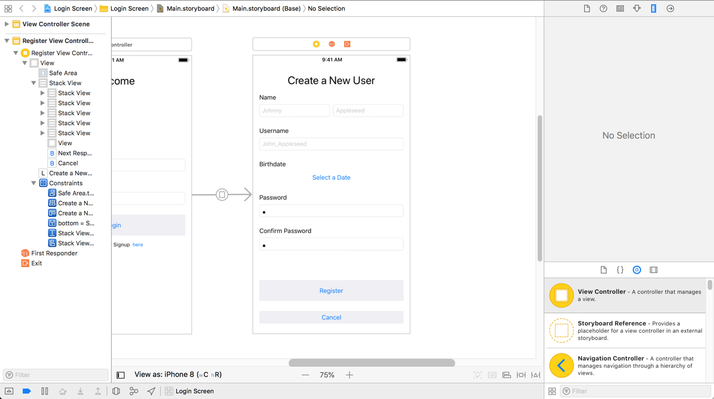
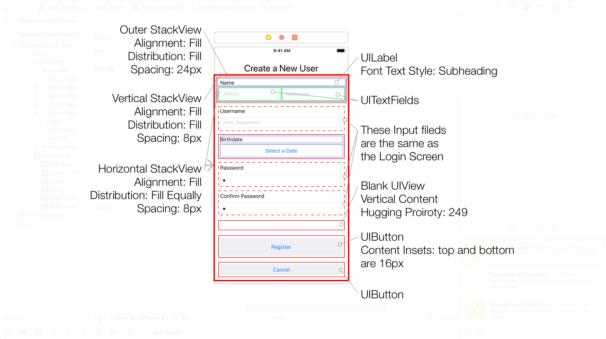

Now that we have the **RegisterViewController** wired up to segue from the **Login Screen**, let's begin thinking about the **Register Screen** and what it'll look like.

# What goes on a Register Screen

Our client wants to collect a few things when a new user likes to register for their app.
Here are a few things they'd like to collect from the user:

- First and last name
- Email
- Username
- Birth date, and
- Password

All of the input we want to collect from the user we can use more `UITextField`s.
But, we'll have to use something else when we want to collect the birth date.
We'll add a custom view controller when we cross that bridge.
For now, let's worry about the other inputs.

# Laying out the Register Screen

Here we got the final result our register screen should look like:

Here is the annotated result of our register screen:

> [info]
> If you like, try to layout this screen on your own. And if you, be sure to compare your project with the annotated screenshot.
> If your project matches, then skip to the next page of this tutorial.

Let's open up the storyboard and add the text fields first.
We'll also add a button to allow the user to add a birth date.

> [action]
>

### ENd
