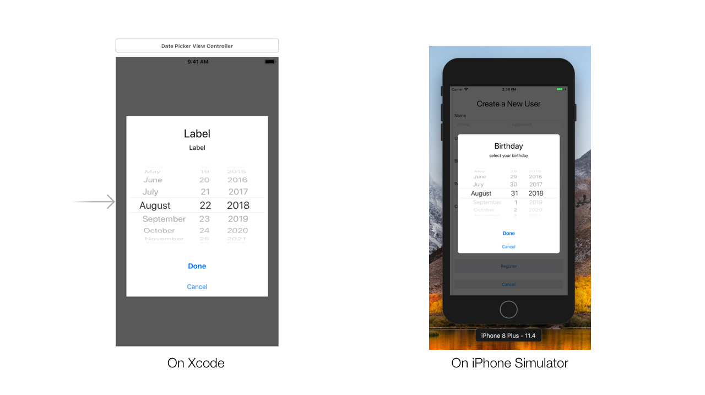
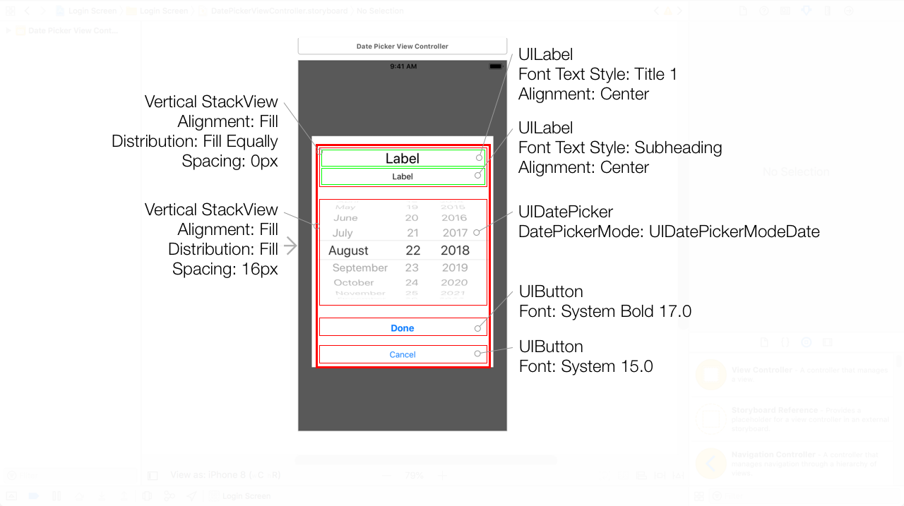
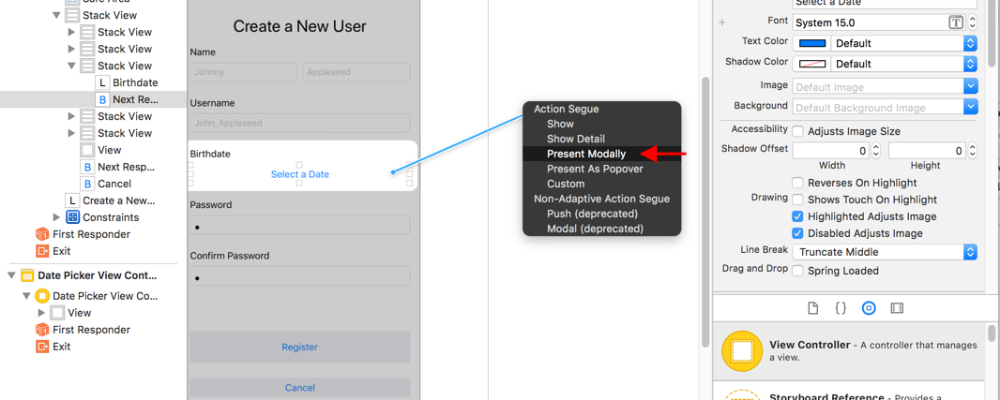
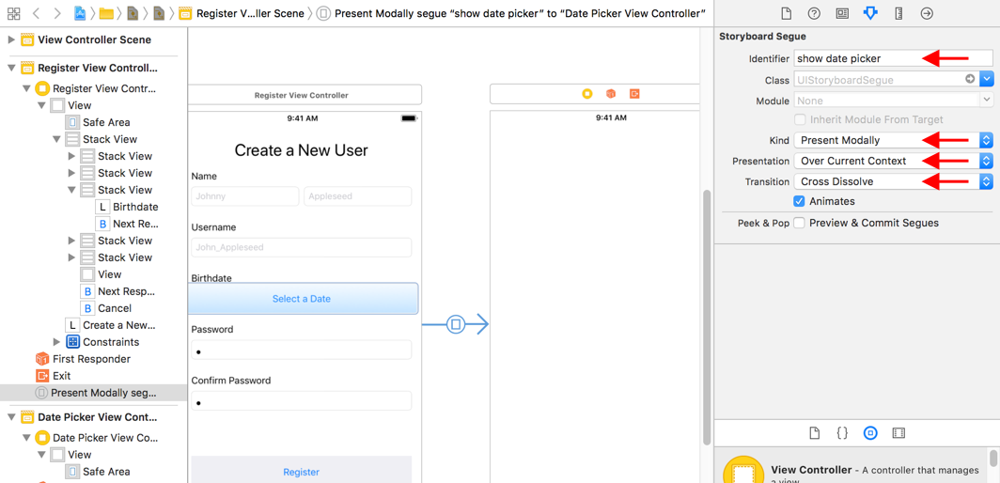
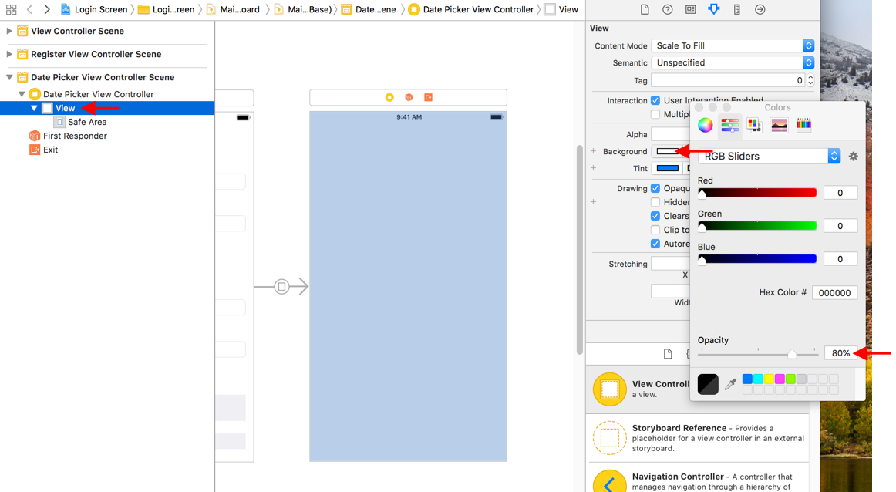

So, we have the **Register Screen** all set up in the storyboard including the button the user can tap to enter their birth date.
Now, we got to provide a UI for the user to pick a date.
Luckily for us, `UIKit` includes a class that does just this, the UIDatePicker.

# Use the UIDatePicker class

This class does just that, it allows the user to select a date, or time, and we can retrieve the selected date.
This class has a few useful properties:

- `date: Date` this will give us the selected date
- `maximumDate: Date?` by default this value is nil, but if we set this property to be tomorrow, the user can only select dates from today or in the past
- `minimumDate: Date?` just like maximumDate, this is the inverse. Meaning, if this property is set to a date, the user cannot select a date later than the given date
- `datePickerMode: UIDatePickerMode` this is an enum with the following cases:

```swift
enum UIDatePickerMode {
  case UIDatePickerModeTime //picker for the time only
  case UIDatePickerModeDate //picker for the date only
  case UIDatePickerModeDateAndTime //picker for both date and time
  case UIDatePickerModeCountDownTimer //picker for selecting hour and minute
}
```

In our case, the `datePickerMode` we'll be using is `UIDatePickerModeDate` since we only need the year, day, and month but not the time.

Now, how will we add the `UIDatePicker`? We could add it to the **Outer StackView** but this date picker takes up a lot of space. Instead of finding a spot to place it in our Register's view, let's create a new view controller primarily responsible of selecting a date.

# DatePickerViewController

In this view controller, we're going to use the `UIDatePicker` to allow the user to select a date. We'll also add a **Done** and **Cancel** button as well.

> [action]
> Create a new view controller file named `DatePickerViewController` and add the following code inside the class:
>
```swift
class DatePickerViewController: UIViewController {
>
    @IBOutlet weak var datePicker: UIDatePicker!
>
    @IBAction func pressDone(sender: Any) {
>
    }
>
    @IBAction func pressCancel(sender: Any) {
>
    }
}
```

Here we've added two `@IBAction`s for the done and cancel buttons.
Also, we've added an `@IBOutlet` to the date picker so we can retrieve the `date` the user selects.

# Laying out the DatePickerViewController in the Storyboard

Here we got the final result our date picker screen:



Here is the annotated result of our register screen:



> [info]
> If you like, try to layout this screen on your own. And if you, be sure to compare your project with the annotated screenshot.
> If your project matches, then skip to the next page of this tutorial.

Let's open up the storyboard and add the a view controller to our storyboard:

> [action]
> From the **Object Pallet** add a *UIViewController* to the right of the **RegisterViewController** in the storyboard. This will be used for our **DatePickerViewController** class we just made previously.

> [info]
> Don't forget to update the *UIViewController*'s **Identity** from *UIViewController* to *DatePickerViewController*.

We'll be trying something new with how we'll segue to this view controller.
This view controller well be presented over the current screen but with a transparent background.
Take a look up at the screenshot with the iPhone preview and notice how we can still see the **RegisterViewController** behind it.

> [action]
> In the **RegisterViewController**, select the **Select a Date Button** and create a **Segue** from the button to the **DatePickerViewController**. But, instead of selecting **show** as the Segue Action select **Present Modally**.



> [action]
> Select the segue and update the following:



Before we test this out let's make the **DatePickerViewController** transparent.

> [action]
> Select the **view** of the **DatePickerViewController** and in the **Attributes Inspector** update the **Background Color** to **Black** and the **Opacity** to **80%**:




### ENd
