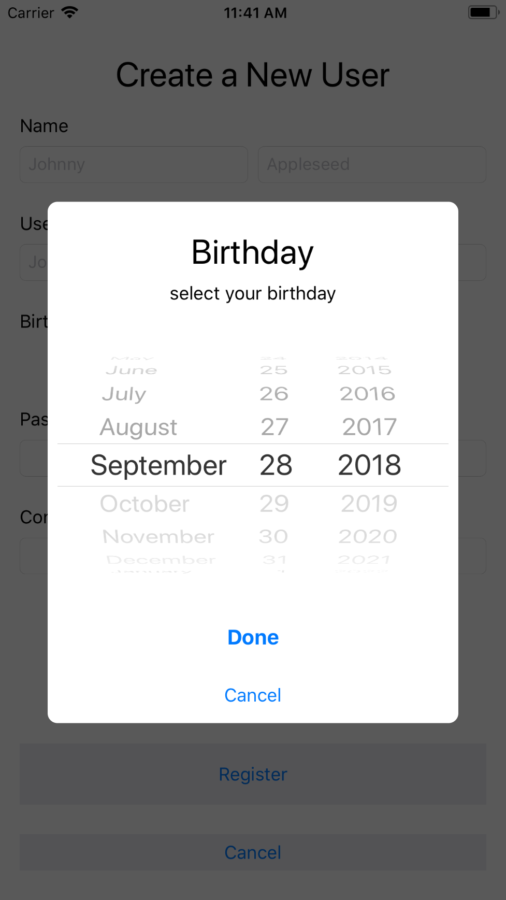
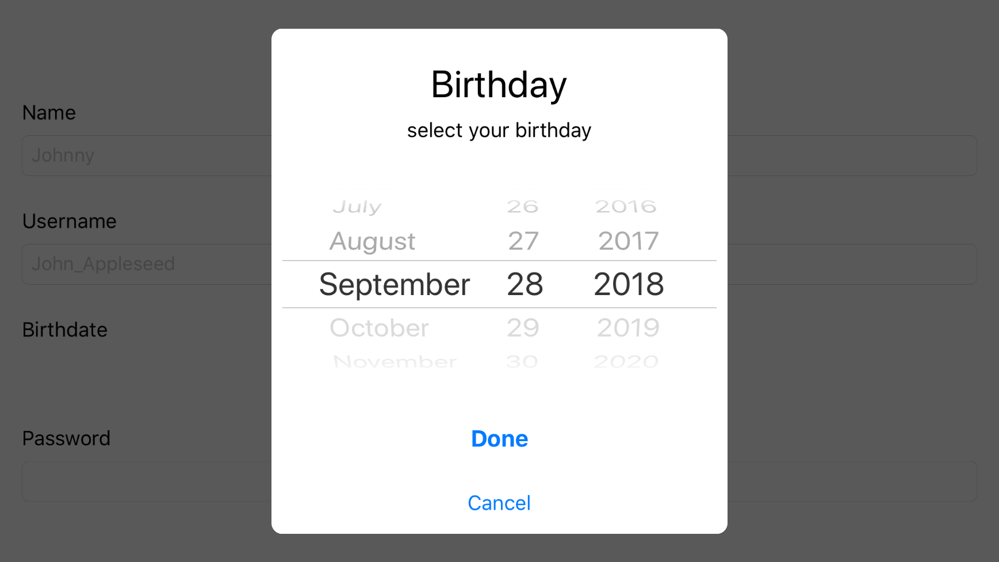
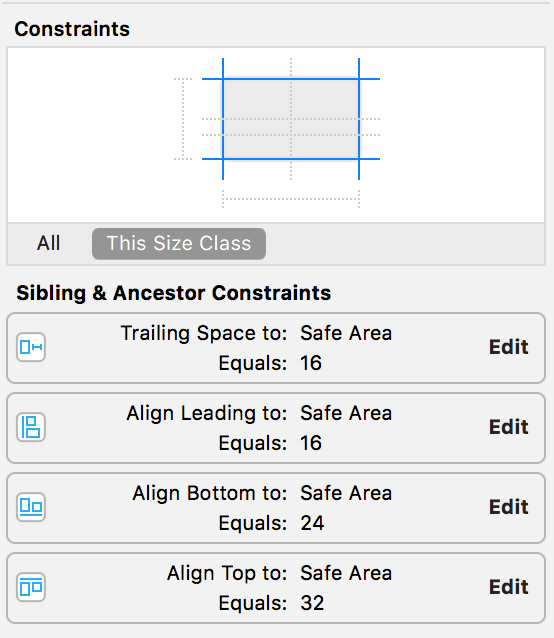
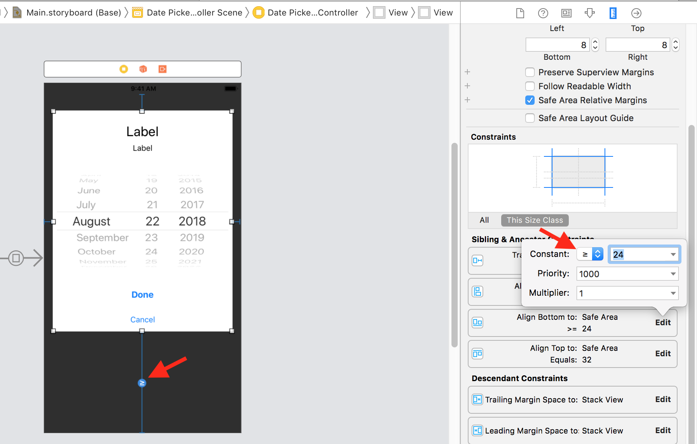
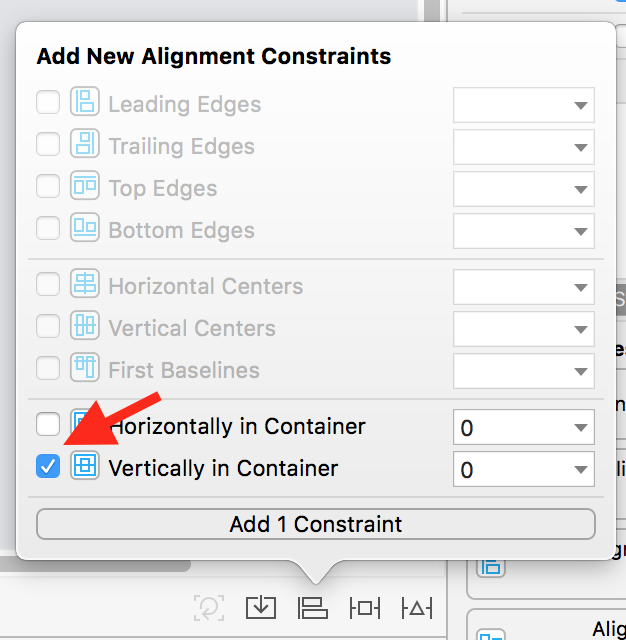
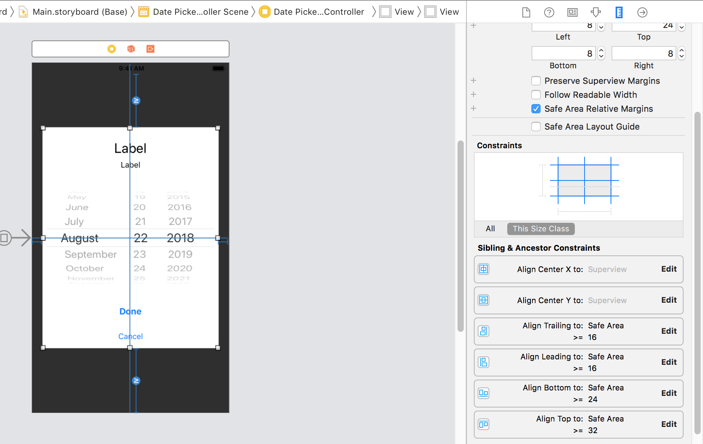

So, we have the **Register Screen** all set up in the storyboard including the button the user can tap to enter their birth date.
Now, we got to provide a UI for the user to pick a date.
Luckily for us, `UIKit` includes a class that does just this, the UIDatePicker.

# Use the UIDatePicker class

This class does just that, it allows the user to select a date, or time, and we can retrieve the selected date.
This class has a few useful properties:

- `date: Date` this will give us the selected date
- `maximumDate: Date?` by default this value is nil, but if we set this property to be tomorrow, the user can only select dates from today or in the past
- `minimumDate: Date?` just like maximumDate, this is the inverse. Meaning, if this property is set to a date, the user cannot select a date later than the given date
- `datePickerMode: UIDatePickerMode` this is an enum with the following cases:

```swift
enum UIDatePickerMode {
  case UIDatePickerModeTime //picker for the time only
  case UIDatePickerModeDate //picker for the date only
  case UIDatePickerModeDateAndTime //picker for both date and time
  case UIDatePickerModeCountDownTimer //picker for selecting hour and minute
}
```

In our case, the `datePickerMode` we'll be using is `UIDatePickerModeDate` since we only need the year, day, and month but not the time.

Now, how will we add the `UIDatePicker`? We could add it to the **Outer StackView** but this date picker takes up a lot of space. Instead of finding a spot to place it in our Register's view, let's create a new view controller primarily responsible of selecting a date.

# DatePickerViewController

In this view controller, we're going to use the `UIDatePicker` to allow the user to select a date. We'll also add a **Done** and **Cancel** button as well.

> [action]
> Create a new view controller file named `DatePickerViewController` and add the following code inside the class:
>
```swift
class DatePickerViewController: UIViewController {
>
    @IBOutlet weak var datePicker: UIDatePicker!
>
    @IBAction func pressDone(_ sender: Any) {
>
    }
>
    @IBAction func pressCancel(_ sender: Any) {
>
    }
}
```

Here we've added two `@IBAction`s for the done and cancel buttons.
Also, we've added an `@IBOutlet` to the date picker so we can retrieve the `date` the user selects.

# Laying out the DatePickerViewController

Here we got the final result our date picker screen:


Here is the annotated result of our register screen:


> [info]
> If you like, try to layout this screen on your own. And if you, be sure to compare your project with the annotated screenshot.
> If your project matches, then skip to the next page of this tutorial.

# Setting up the Storyboard

Let's open up the storyboard and add the a view controller to our storyboard:

> [action]
> From the **Object Pallet** add a *UIViewController* to the right of the **RegisterViewController** in the storyboard. This will be used for our **DatePickerViewController** class we just made previously.

> [info]
> Don't forget to update the *UIViewController*'s **Identity** from *UIViewController* to *DatePickerViewController*.

We'll be trying something new with how we'll segue to this view controller.
This view controller well be presented over the current screen but with a transparent background.
Take a look up at the screenshot with the iPhone preview and notice how we can still see the **RegisterViewController** behind it.

> [action]
> In the **RegisterViewController**, select the **Select a Date Button** and create a **Segue** from the button to the **DatePickerViewController**. But, instead of selecting **show** as the Segue Action select **Present Modally**.


> [action]
> Select the segue and update the following:


Before we test this out let's make the **DatePickerViewController** transparent.

> [action]
> Select the **view** of the **DatePickerViewController** and in the **Attributes Inspector** update the **Background Color** to **Black** and the **Opacity** to **80%**:


# Laying out the Date Picker Screen in the Storyboard

We're going to start with the out most view and work our way in.
Let's set up the empty `UIView` and the constraints for that view.
We're going to use this new view as a container view for the `UIDatePicker` and some buttons.

> [action]
> Add a new `UIView` from the **Object Pallet** to the **DatePickerViewController** in the storyboard.
> Then, select the newly added view and add the following constraints:
> **Top:** 32px **Right:** 16px **Bottom:** 24px **Left** 16px


What will go in this **container view**:

- `UILabel` for the Header
- `UILabel` for the Subheader
- `UIDatePicker` for the date
- `UIButtons` for the done and cancel actions

Let's continue with the header and subheader labels.

> [action]
> Add two `UILabel`s to the **inside of the container view** we just added (**make sure they're inside the container view versus the view controller's view**).
> For the first label, adjust the **Font Style** from *System* to *Title 1*.
> We'll make this the header label.
>
> Then, update the second label's **Font Style** to *Subhead*.
> Lastly, select both labels and stack them in a **vertical stack view**.

You should have something like this:


We're going to have some red errors with our constraints for a few steps, but we'll clear them as we go.

Next, let's add the `UIDatePicker` and the two buttons:

> [action]
> Drag a `UIDatePicker` just bellow the **vertical stack view**.
> Since we'll be adding the **vertical stack view**, the newly added **date picker** and **buttons** to an outer stack view, the size of the date picker doesn't matter.
>
> Select the **date picker** and update the **Mode** from *Date and Time* to *Date* in the **Attributes Inspector**.
>
> Also, update its **Vertical Content Compression Resistance**, located in the **Size Inspector**, from *250* to *249*.
> This will become important later in the lesson.

> [action]
> Drag two `UIButton`s bellow the **date picker**.
> For the first one, update its **Font Style** to *System Bold 17.0* and title the button **Done**.
> And the second button, update its **Font** to *System 15* and title it **Cancel**.


Now for the outer stack view, we'll be stacking all of the components that are in the **container view** into an outer stack view:

> [action]
> Select the **vertical stack view**, that is containing the **header** and **subheader** labels, the **date picker** and the **two buttons** and **Embed them into a Stack View**.
> Make sure this new stack view is a **vertical stack view** that contains all of the elements inside the **container view**.
>
> Select the newly added **stack view** and update the following:
>
> - **Alignment:** Fill
> - **Distribution:** Fill
> - **Spacing:** 16px

We still have our red errors indicating we have either conflicting constraints or ambiguity in our layout (meaning there isn't enough of constraints to properly layout each view). Let's fix that by pinning the **outer stack view** to the **container view**.

> [action]
> Select the **outer stack view** and add the following constraints:
>
> Open the **Add New Constraints** dialogue and add **top, trailing, bottom and leading** constraints with the value of **zero** for the spacing. **Check on** the **Constraint to Margin** then click **Add 4 Constraints**


# Refactoring the Constraints of the Container View

Now, if we look at our **date picker screen** it looks a bit large.
This is because we gave the **container view** constraints to pin its superview.
Let's change each constraint while adding a few more to have the following behavior:





When the phone is in portrait, the card will expand horizontally, but shrink vertically and centered.
But, when the phone is in landscape, the card will expand vertically, but shrink horizontally and centered.
Let's see how we can achieve this behavior.

> [action]
> Select the **container view** and open the **Size Inspector** and look for **Sibling & Ancestor Constraints**.

Make sure all four constraints look like this:



What we need to do is allow each constraint to be equal or larger than the given constant.

> [action]
> Look for **Align Bottom to: Safe Area** in the list of **Sibling & Ancestor Constraints** table and click **Edit**.
> A popup will appear. Open the dropdown and select **Greater Than or Equal to**.
> The bottom constraint will extend larger than our given constant which is **24px**.



> [action]
> Do this to the **Align Top to: Safe Area** constraint.
> You will get a constraint error after applying the **Greater Than or Equal to** to the **Align Top to: Safe Area** constraint.

Since the **container view**'s top and bottom constraints are allowed to expand, auto layout doesn't know where to vertically place this view.
So, let's add a constraint that will center the **container view** vertically.

> [challenge]
> Add a **Center Vertically Constraint** to the **container view** to fix the autolayout error.

> [solution] The end result should look like this:
>
> 

Fixed! Now our **container view** will shrink to the smallest it needs to be vertically, but stay contained within the Safe Area.
Now, go ahead and apply the same changes to the **Trailing Space to: Safe Area** and **Align Leading to: Safe Area** constraints.

> [challenge]
> Apply the same changes to allow the **container view** to shrink and center horizontally.

The end result should look like this:



# Wrapping up the Date Picker screen

Alright, we've laid out each component and it looks great!
There's a done and cancel button, as well as a header and subtitle label.
Now, let's hook it up with the controller in the next page.
